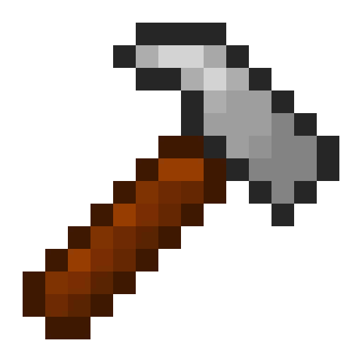
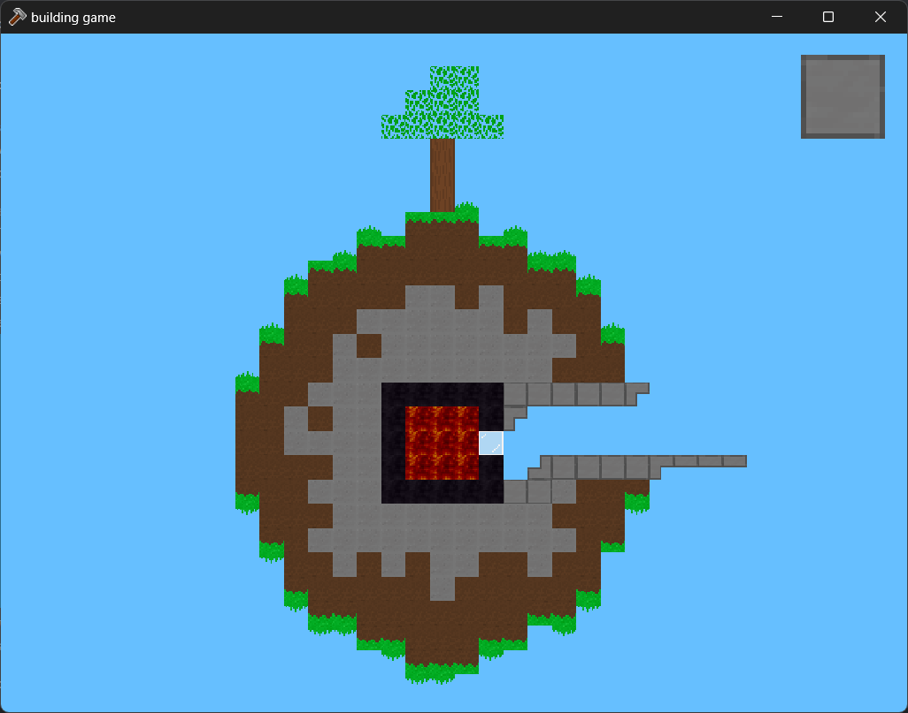



### building game

a game, where you just place tiles

---

### rewriting progress
- [x] the world!!!
- [x] pause
- [x] settings
- [x] main menu
- [x] tile packs
- [x] dynamic tiles
- [x] infection ~~block~~ tile

its finished!!!!!

### new features
- bugs
- better camera
- localization
- bad, but more stable than previous, ui framework
- dynamic tile atlas (reloadable ingame)
- world menu but better

#### made with 🐛🐛🐛 by danilwhale (rooster) :3